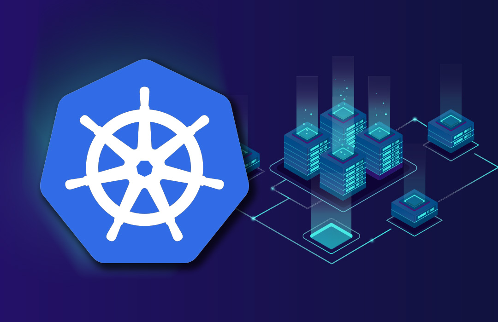

# What is Infrastructure As Code 🤔? 
Infrastructure as Code (IaC) is the management of infrastructure (networks, virtual machines, load balancers, and connection topology) in a descriptive model, using the same versioning as DevOps team uses for source code. Like the principle that the same source code generates the same binary, an IaC model generates the same environment every time it is applied. IaC is a key DevOps practice and is used in conjunction with continuous delivery.

- Write and execute code to define, deploy, and update an infrastructure
- Almost all parts of the infrastructure managed as code, including:
    - Servers
    - Storage (structured and unstructured)
    - Networks
    - Application configuration
- Create standard, repeatable processes for building, modifying, and destroying entire environments

## Disposable Infrastructure 🗑️🖥️
- Machines in the cloud need to be disposable
    - Don’t fix broken machines
    - Don’t install patches
    - Don’t upgrades machines
- If you need to fix a machine, delete it and recreate a new one
- To make infrastructure disposable, automate everything with code
    - Can automate using scripts
    - Can use declarative tools to define infrastructure

## Why IaC 🤷🏾‍♀️?
- IaC allows for the quick provisioning and removing of infrastructures
    - Build an infrastructure when needed
    - Destroy the infrastructure when not in use
    - Results in reduced cloud costs
- Create identical infrastructures for dev, test, and prod
- Can be part of a CI/CD pipeline
- Templates are the building blocks for disaster recovery procedures

---

# Docker

A **container** is a standard unit of software that packages up code and all its dependencies so the application runs quickly and reliably from one computing environment to another. A Docker container image is a lightweight, standalone, executable package of software that includes everything needed to run an application: code, runtime, system tools, system libraries and settings.

Container **images** become containers at runtime and in the case of Docker containers - images become containers when they run on Docker Engine. Available for both Linux and Windows-based applications, containerized software will always run the same, regardless of the infrastructure. Containers isolate software from its environment and ensure that it works uniformly despite differences for instance between development and staging.

A **registry** is used as a repository to store container images. In this projest we use dockerhub.

---

# Kubernetes K8s ☸️ 

Kubernetes is a portable, extensible, open-source platform for managing containerized workloads and services, that facilitates both declarative configuration and automation. It has a large, rapidly growing ecosystem. Kubernetes services, support, and tools are widely available.

The name Kubernetes originates from Greek, meaning helmsman or pilot. K8s as an abbreviation results from counting the eight letters between the "K" and the "s". Google open-sourced the Kubernetes project in 2014. Kubernetes combines over 15 years of Google's experience running production workloads at scale with best-of-breed ideas and practices from the community.

## Deployments: 
A Deployment provides declarative updates for Pods and ReplicaSets.

You describe a desired state in a Deployment, and the Deployment Controller changes the actual state to the desired state at a controlled rate. You can define Deployments to create new ReplicaSets, or to remove existing Deployments and adopt all their resources with new Deployments.

In this proeject we have two deployments to demostrate microservices:
- Backend app -> nodebackend
- Frontend app -> nodefrontend

## Namespace:
In Kubernetes, namespaces provides a mechanism for isolating groups of resources within a single cluster. Names of resources need to be unique within a namespace, but not across namespaces. Namespace-based scoping is applicable only for namespaced objects (e.g. Deployments, Services, etc) and not for cluster-wide objects (e.g. StorageClass, Nodes, PersistentVolumes, etc).

In this project we use one namespace "nodebackend" to organize our entire application stack and network.

## load balancer:
When creating a Service, you have the option of automatically creating a cloud load balancer. This provides an externally-accessible IP address that sends traffic to the correct port on your cluster nodes, provided your cluster runs in a supported environment and is configured with the correct cloud load balancer provider package.
You can also use an Ingress in place of Service.

In this project we use a load balancer service to expose our frontend app to the outside world.

## clusterIp:
Used to define a load balancer service internal to the local network to route messages in the cluster.

In this project a clusterIP is used to send messages from the exposed frontend application to the backend application.
